# Arquitetura E UML — Museu TJSC

Documento técnico em português do Brasil para descrever a arquitetura do projeto `museu-tjsc` e gerar diagramas UML.

Atualizado em: 2026-05-20.

## Objetivo Do Sistema

O sistema é uma aplicação pública React/Vite que apresenta a área de Memória do Poder Judiciário de Santa Catarina em linguagem museológica/editorial. A aplicação centraliza dados curatoriais no código, monta páginas públicas e pode ser publicada como pacote estático em ambiente Liferay do TJSC.

O sistema não é gestor de acervo, não é API de metadados, não é banco documental e não substitui o AtoM. O AtoM permanece como plataforma externa de pesquisa arquivística avançada.

## Como Usar Este Documento Para UML

| Diagrama | Seção principal |
|---|---|
| Casos de uso | `Atores` e `Casos De Uso` |
| Componentes | `Camadas E Componentes` |
| Classes | `Modelo De Dados` |
| Sequência | `Fluxos Principais` |
| Implantação | `Implantação E Publicação` |
| Atividade | `Fluxo De Publicação Liferay` |
| Máquina de estados | `Estados Do Diálogo De Imagem` |
| Pacotes | `Diagrama De Pacotes` |

Os blocos PlantUML são modelos prontos para uma ferramenta PlantUML.

## Fronteiras Do Sistema

### Dentro Do Sistema

- Aplicação React em `client/src/main.tsx`.
- Roteamento interno em `client/src/App.tsx` com Wouter `useHashLocation`.
- Componentes em `client/src/components/`: `ErrorBoundary`, `Layout`, `PageIntro`, `ExhibitionCard`, `ZoomableImageDialog`.
- Páginas em `client/src/pages/` (17 incluindo `NotFound`).
- Dados em `client/src/data/`: `memoria.ts`, `composicao.ts`, `types.ts`.
- Resolução de assets locais em `client/src/lib/publicAssetUrl.ts`.
- Estilos globais escopados em `.museu-tjsc-app` (`client/src/index.css`).
- Pós-processamento Liferay em `scripts/scope-liferay-css.mjs`.
- Servidor Express opcional em `server/index.ts`.

### Fora Do Sistema

- Portal TJSC/Liferay, hospedeiro institucional.
- AtoM (`https://atom.tjsc.jus.br/`), pesquisa arquivística externa.
- PDFs e documentos servidos pelo TJSC.
- Imagens remotas oficiais servidas pelo TJSC.
- YouTube, host de vídeos referenciados na seção História Oral, Vídeos e Eventos.

## Atores

| Ator | Papel |
|---|---|
| Visitante Público | Acessa páginas curatoriais, exposições, capela e visitação |
| Pesquisador(a) | Procura acervo, história escrita, história oral, AtoM, biblioteca |
| Equipe Museu/Memória | Revisa conteúdo, valida dados, aprova publicação institucional |
| Equipe Portal/Liferay | Publica os arquivos estáticos no ecossistema TJSC |
| Mantenedor(a) Do Código | Altera React, dados estruturados, estilos, build, documentação |
| Serviços Externos | AtoM, documentos oficiais, imagens remotas, YouTube |

## Casos De Uso

| Caso de uso | Ator principal | Resultado esperado |
|---|---|---|
| Navegar pelo Museu | Visitante Público | Acessa home e segue para percursos, exposições, acervo ou visitação |
| Consultar exposições | Visitante Público | Vê galeria com cartões homogêneos, amplia imagens e abre página oficial |
| Ampliar imagem | Visitante Público | Abre `ZoomableImageDialog` portaled, navega/fecha por teclado |
| Consultar história do Tribunal | Visitante Público | Lê panorama e timeline institucional |
| Consultar história escrita | Pesquisador(a) | Acessa 2 publicações e 9 volumes em PDF |
| Consultar história oral | Pesquisador(a) | Acessa 16 vídeos, incluindo teaser |
| Consultar composição por gestão | Visitante Público | Navega 57 gestões via `radiogroup` com teclado |
| Pesquisar acervo no AtoM | Pesquisador(a) | Sai para páginas HTML públicas do AtoM |
| Ver dados de visitação | Visitante Público | Recebe horário, endereço, e-mail, telefones |
| Atualizar conteúdo estruturado | Mantenedor(a) | Ajusta `memoria.ts`/`composicao.ts` e valida com check/build |
| Publicar em Liferay | Equipe Portal/Liferay | Publica `dist/public` no portal sem disputar rotas |

Inclusões e extensões relevantes:

- `Consultar exposições` inclui `Ampliar imagem`.
- `Pesquisar acervo no AtoM` redireciona para sistema externo, não compõe a aplicação.

## Camadas E Componentes

### Entrada Da Aplicação

- `client/index.html`: HTML base usado pelo Vite.
- `client/src/main.tsx`: monta `<App />` em `#museu-tjsc-root`.
- `client/src/App.tsx`: define `ErrorBoundary` dentro de `.museu-tjsc-app`, registra `Router` com `useHashLocation`, configura `ScrollToTop` com restauração de `history.scrollRestoration` e mapeia rotas.

### Roteamento

- Biblioteca: Wouter.
- Hook ativo: `useHashLocation`.
- URLs internas mantidas como `/historia`, mas o navegador exibe `#/historia`.
- Skip link compatível com hash routing: `Layout.tsx` chama `focusMainContent` que `preventDefault()` e foca `<main id="museu-tjsc-main" tabIndex={-1}>`.

### Layout E Navegação

- `Layout.tsx`: cabeçalho fixo com navegação em duas camadas; link `AtoM` externo; skip link acessível.
- `PageIntro.tsx`: cabeçalho padrão de páginas internas com link de retorno para `/` (`Memória TJSC`).
- `ErrorBoundary.tsx`: fallback em PT-BR; oculta stack trace em produção; mantido dentro de `.museu-tjsc-app` para preservar o CSS escopado.

### Componentes Visuais Especializados

- `ExhibitionCard.tsx`: imagem ampliável + link para a página oficial da exposição.
- `ZoomableImageDialog.tsx`: Radix Dialog portaled com wrapper `.museu-tjsc-app`, lazy/async loading no trigger, foco preso, fechamento por overlay/`Escape`/botão.

### Páginas Públicas (17)

| Componente | Propósito |
|---|---|
| `Home.tsx` | Hero, sala permanente, quatro percursos editoriais |
| `Museu.tsx` | Apresentação do museu, dados de visitação |
| `AcervoDigital.tsx` | Núcleos de acervo, busca AtoM, atalhos AtoM |
| `Historia.tsx` | Panorama e timeline institucional |
| `HistoriaEscrita.tsx` | Publicações e 9 volumes oficiais |
| `HistoriaOral.tsx` | 16 vídeos de história oral |
| `Composicao.tsx` | Grade radiogroup de 57 gestões com painel lateral |
| `Exposicoes.tsx` | Galeria com destaque + arquivo por ano |
| `Capela.tsx` | Capela Ecumênica, galeria e biografia |
| `Biblioteca.tsx` | Biblioteca Desembargador Marcílio Medeiros |
| `Arquivo.tsx` | Arquivo e guarda permanente |
| `Videos.tsx` | Vídeos do TJSC |
| `Eventos.tsx` | Vídeos de eventos |
| `Visitacoes.tsx` | Horário, endereço, contatos |
| `Pesquisa.tsx` | Orientação de pesquisa |
| `Atribuicoes.tsx` | Atribuições institucionais |
| `NotFound.tsx` | Erro de rota (envolto por `Layout`) |

### Dados Estruturados

- `client/src/data/types.ts`: 6 tipos públicos (`Source`, `Exhibition`, `Publication`, `TimelineEvent`, `OralHistoryInterview`, `CompositionTerm`).
- `client/src/data/memoria.ts`: dados curatoriais e oficiais (ver `Exportações De Dados`).
- `client/src/data/composicao.ts`: 57 gestões em `compositionTerms` com membros, datas, fotos locais e fonte.

### Infraestrutura De Build E Publicação

- `vite.config.ts`: Vite + React + Tailwind, `base: "./"`, dev/preview ancorados em `127.0.0.1`.
- `package.json`: scripts, dependências mínimas, `"private": true`.
- `scripts/scope-liferay-css.mjs`: escopa o CSS final em `.museu-tjsc-app`.
- `server/index.ts`: Express opcional que serve `dist/public`, com host local por padrão, sem `X-Powered-By` e headers básicos de segurança.
- `client/src/lib/publicAssetUrl.ts`: base pública configurável via `VITE_PUBLIC_ASSET_BASE`.

## Rotas Internas

| URL Interna | URL No Navegador Com Hash | Componente |
|---|---|---|
| `/` | `#/` | `Home` |
| `/museu` | `#/museu` | `Museu` |
| `/acervo-digital` | `#/acervo-digital` | `AcervoDigital` |
| `/historia` | `#/historia` | `Historia` |
| `/historia-oral` | `#/historia-oral` | `HistoriaOral` |
| `/historia-escrita` | `#/historia-escrita` | `HistoriaEscrita` |
| `/capela` | `#/capela` | `Capela` |
| `/videos` | `#/videos` | `Videos` |
| `/arquivo` | `#/arquivo` | `Arquivo` |
| `/biblioteca` | `#/biblioteca` | `Biblioteca` |
| `/composicao` | `#/composicao` | `Composicao` |
| `/exposicoes` | `#/exposicoes` | `Exposicoes` |
| `/visitacoes` | `#/visitacoes` | `Visitacoes` |
| `/pesquisa` | `#/pesquisa` | `Pesquisa` |
| `/atribuicoes` | `#/atribuicoes` | `Atribuicoes` |
| `/eventos` | `#/eventos` | `Eventos` |
| `/404` | `#/404` | `NotFound` |

## Modelo De Dados

| Tipo | Campos | Onde é usado |
|---|---|---|
| `Source` | `label`, `url`, `verifiedAt` | `sources` em `memoria.ts` |
| `Exhibition` | `year`, `title`, `url`, `imageUrl`, `imageAlt`, `sourceUrl` | `exhibitions` (32) |
| `Publication` | `title`, `subtitle`, `year`, `description`, `url`, `imageUrl?`, `imageAlt?`, `sourceUrl` | `publications` (2), `writtenHistoryVolumes` (9) |
| `TimelineEvent` | `year`, `title`, `description` | `timeline` (16) |
| `OralHistoryInterview` | `name`, `url`, `imageUrl`, `imageAlt` | `oralHistoryInterviews` (16) |
| `CompositionTerm` | `period`, `presidentTitle?`, `president`, `dateRange`, `imageUrl`, `imageAlt`, `sourceUrl`, `members` | `compositionTerms` (57) |

## Exportações De Dados

### `memoria.ts`

| Exportação | Tipo | Quantidade | Função |
|---|---|---:|---|
| `VERIFIED_AT` | `string` | 1 | Data interna de verificação |
| `sources` | `Record<string, Source>` | 17 | Mapa de fontes por seção |
| `museumFacts` | `string[]` | 5 | Fatos do museu |
| `visitInfo` | objeto | 1 | Endereço, horário, contatos |
| `acervoCategories` | `string[]` | 7 | Núcleos do acervo |
| `publications` | `Publication[]` | 2 | Publicações principais |
| `writtenHistoryVolumes` | `Publication[]` | 9 | Volumes oficiais |
| `exhibitions` | `Exhibition[]` | 32 | Exposições |
| `timeline` | `TimelineEvent[]` | 16 | Marcos institucionais |
| `videos` | objeto[] | 2 | Vídeos principais |
| `eventVideos` | objeto[] | 4 | Vídeos de eventos |
| `oralHistoryInterviews` | `OralHistoryInterview[]` | 16 | Vídeos de história oral (inclui teaser) |
| `atribuicoes` | `string[]` | 12 | Atribuições institucionais |
| `findExhibitionByTitle` | função | — | Seletor por título, evita índice frágil |
| `curatedPaths` | objeto[] | 4 | Percursos editoriais da home |

### `composicao.ts`

- `compositionTerms`: 57 gestões com presidência, período, foto local, fonte e lista completa de membros.

## Regras De Assets

- URLs `http`, `https`, `mailto`, `tel`, `#`, `data:` são preservadas por `publicAssetUrl`.
- Sem `VITE_PUBLIC_ASSET_BASE`: caminho local `/images/...` vira `./images/...`.
- Com `VITE_PUBLIC_ASSET_BASE`: caminho local vira `${VITE_PUBLIC_ASSET_BASE}/images/...`.
- Use a variável quando `images/` for publicado fora do diretório do `index.html`.
- A variável aponta para a base que contém `images/`, não para a URL da página Liferay.

## Fluxos Principais

### Fluxo De Inicialização

1. Navegador carrega `index.html`.
2. Vite entrega CSS/JS relativos `./assets/...`.
3. `main.tsx` localiza `#museu-tjsc-root`.
4. `main.tsx` monta `<App />`.
5. `App.tsx` envolve `ErrorBoundary` no escopo `.museu-tjsc-app`, registra `Router` e `ScrollToTop`.
6. `ScrollToTop` salva `history.scrollRestoration` e usa modo manual; restaura no unmount.
7. Rota atual renderiza a página correspondente.

### Fluxo De Navegação Interna

1. Usuário clica em `<Link href="/historia">`.
2. Wouter intercepta o clique.
3. `useHashLocation` atualiza a URL para `#/historia`.
4. O navegador não solicita `/historia` ao Liferay.
5. `Switch` renderiza `Historia`.

### Fluxo De Skip Link

1. Usuário pressiona `Tab` ao entrar no site.
2. Foco aparece no link `Ir para o conteúdo principal`.
3. Usuário ativa o link.
4. `focusMainContent` chama `preventDefault`, foca `<main id="museu-tjsc-main">` e rola até ele.
5. Rota e hash permanecem inalterados.

### Fluxo De Imagem Ampliável

1. Página instancia `ZoomableImageDialog` com `src`, `alt`, `caption` e parâmetros opcionais.
2. Trigger renderiza imagem com `loading="lazy"` e `decoding="async"`.
3. Usuário ativa o trigger; Radix Dialog abre via `Dialog.Portal` em wrapper `.museu-tjsc-app`.
4. Overlay e content ficam em viewport (`fixed`), foco preso.
5. Usuário fecha com botão, clique no overlay ou `Escape`.

### Fluxo De Composição Por Gestão

1. `Composicao.tsx` inicializa `activePeriod` com a primeira gestão.
2. Renderiza grade `role="radiogroup"`, cada card como `role="radio"` com `aria-checked`, `aria-controls` e `tabIndex` roving.
3. Clique seleciona a gestão; setas/Home/End movem o foco entre cards e atualizam a seleção.
4. Painel lateral `role="region"` `aria-live="polite"` exibe presidência, período e composição integral.

### Fluxo De Publicação Liferay

1. Mantenedor(a) executa `npx pnpm@10.4.1 build`.
2. Vite gera `dist/public/index.html`, `dist/public/assets/` e `dist/public/images/`.
3. `scripts/scope-liferay-css.mjs` escopa o CSS final em `.museu-tjsc-app`.
4. `esbuild` empacota `server/index.ts` em `dist/index.js`.
5. Equipe do portal publica os arquivos conforme estratégia (Documentos e Mídia, Client Extension, fragmento, etc.).
6. Se `images/` não ficar no mesmo contexto do HTML, build deve receber `VITE_PUBLIC_ASSET_BASE`.
7. Página Liferay carrega o fragmento; aplicação navega por hash sem conflitar com rotas do portal.

## Implantação E Publicação

### Desenvolvimento Local

- Comando: `npx pnpm@10.4.1 dev`.
- URL padrão: `http://127.0.0.1:3000/#/`.

### Pré-Visualização Estática

```bash
npx pnpm@10.4.1 build
npx pnpm@10.4.1 preview
```

URL comum: `http://127.0.0.1:4173/#/`.

### Servidor Express Opcional

```bash
npx pnpm@10.4.1 build
npx pnpm@10.4.1 start
```

Serve `dist/public` e devolve `index.html` para todas as rotas. Em Liferay, o Express normalmente não é usado. Variáveis: `HOST` (default `127.0.0.1`), `PORT` (default `3000`).

### Liferay Com Arquivos Estáticos

Artefatos importantes:

- `dist/public/index.html`.
- `dist/public/assets/*.js`.
- `dist/public/assets/*.css`.
- `dist/public/images/**`.

Se a equipe publicar `index.html`, `assets/` e `images/` no mesmo contexto, a base relativa tende a funcionar. Se publicar via fragmento/snippet com assets em outra base, definir `VITE_PUBLIC_ASSET_BASE` antes do build.

```bash
VITE_PUBLIC_ASSET_BASE="https://www.tjsc.jus.br/documents/d/memoria-museu/museu-static" npx pnpm@10.4.1 build
```

## Variáveis De Ambiente

| Variável | Uso | Obrigatória |
|---|---|---|
| `VITE_PUBLIC_ASSET_BASE` | Base pública para `images/` e assets locais publicados fora do diretório do HTML | Não |
| `HOST` | Host do Express opcional (default `127.0.0.1`) | Não |
| `PORT` | Porta do Express opcional (default `3000`) | Não |
| `NODE_ENV` | Define caminho estático no Express opcional | Não |

## Regras De Segurança E Governança

- Não commitar `.project-config.json`.
- Não commitar `.env*`.
- Não commitar `node_modules/`.
- Não commitar `dist/`.
- Não commitar logs locais de desenvolvimento.
- Aplicação pública não injeta analytics, fontes externas ou trackers em runtime.
- Express opcional desativa `X-Powered-By` e envia `X-Content-Type-Options: nosniff` e `Referrer-Policy: strict-origin-when-cross-origin`.
- Dev/preview escutam `127.0.0.1` por padrão. Para LAN, exigir opt-in explícito (`HOST=0.0.0.0` no servidor).
- Não reintroduzir runtimes auxiliares de depuração ou UI kit genérico no bundle público.
- Não reintroduzir `SourceLink` ou CTA público `Ver no TJSC`.
- Não afirmar fato histórico sem `sourceUrl` correspondente.

## Pontos De Extensão

### Nova Página

1. Criar arquivo em `client/src/pages/`.
2. Adicionar rota em `client/src/App.tsx` mantendo `useHashLocation`.
3. Adicionar item em `Layout.tsx` se a página entrar na navegação principal/grupos.
4. Usar `Layout` e `PageIntro` para consistência visual.
5. Se usar dados oficiais, registrar origem em `sources` (memoria.ts).

### Nova Exposição

1. Adicionar item em `exhibitions` (`memoria.ts`).
2. Usar URL e imagem oficial quando disponível.
3. Para imagem local, usar `publicAssetUrl("/images/...")`.
4. Conferir `imageAlt` descritivo (sem `Miniatura oficial...`).
5. Evitar duplicar título/ano em legenda pública.

### Nova Publicação

1. Adicionar item em `publications` ou `writtenHistoryVolumes`.
2. Informar `title`, `subtitle`, `year`, `description`, `url`, `sourceUrl`.
3. Usar `imageUrl` se houver imagem editorial adequada.

### Nova Entrevista De História Oral

1. Adicionar item em `oralHistoryInterviews`.
2. Manter miniatura oficial em tamanho controlado (`200x134`).
3. Não ampliar imagem remota de baixa resolução além do tamanho nativo.

### Nova Gestão

1. Adicionar item em `compositionTerms` (`composicao.ts`).
2. Garantir `presidentTitle`, `president`, `dateRange`, `imageUrl`, `imageAlt`, `sourceUrl` e `members` completos.
3. Adicionar foto local em `client/public/images/composicao/gestao-YYYY-YYYY.jpg`.

## Diagrama De Pacotes

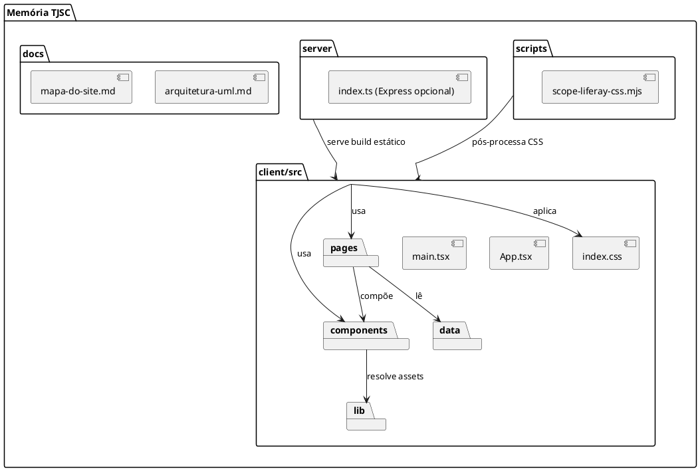

## PlantUML — Casos De Uso

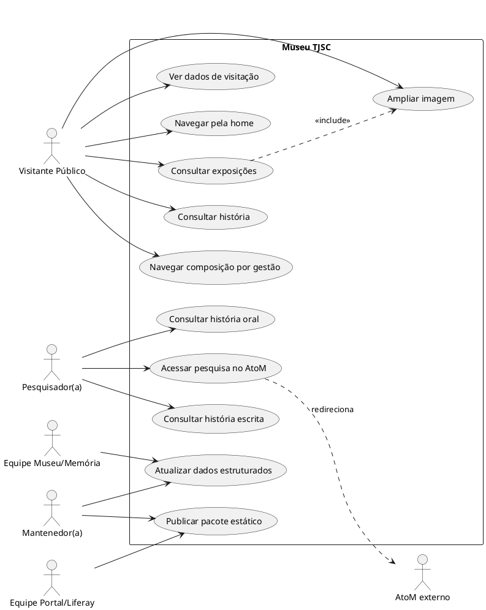

## PlantUML — Componentes

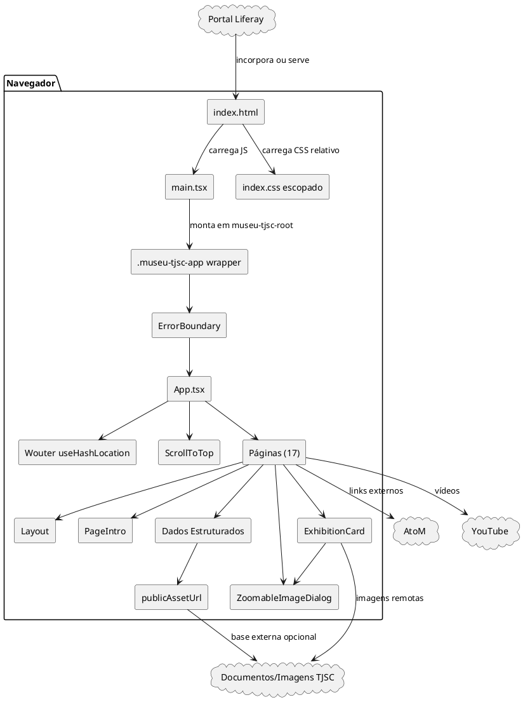

## PlantUML — Classes De Dados

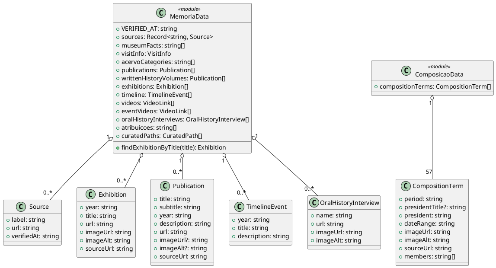

## PlantUML — Sequência De Inicialização

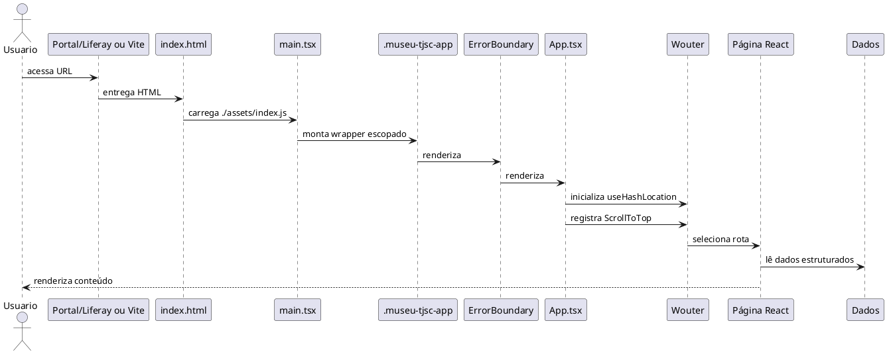

## PlantUML — Sequência De Navegação Hash

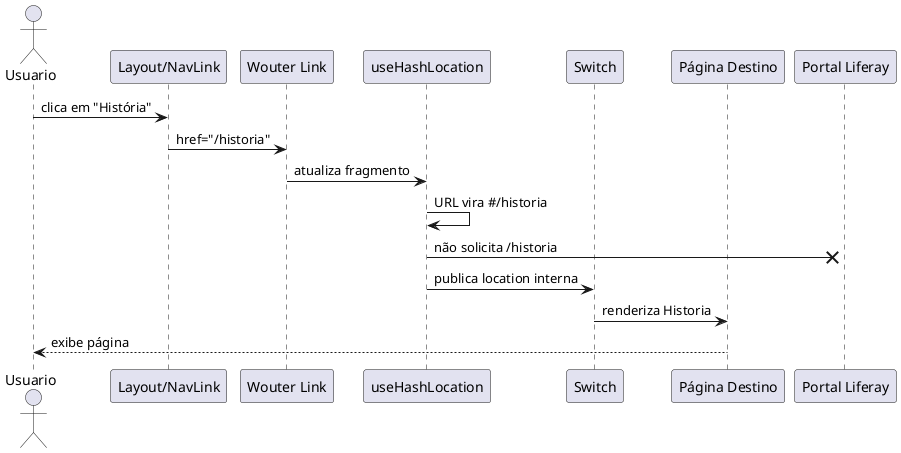

## PlantUML — Sequência De Skip Link

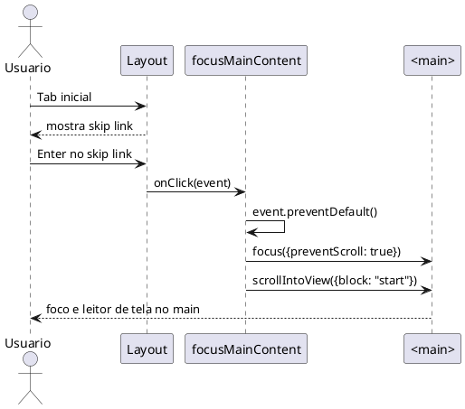

## PlantUML — Sequência De Composição Por Gestão

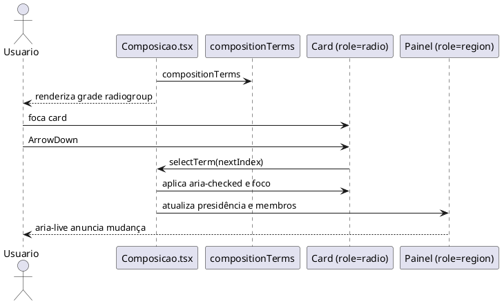

## PlantUML — Sequência De Imagem Ampliável

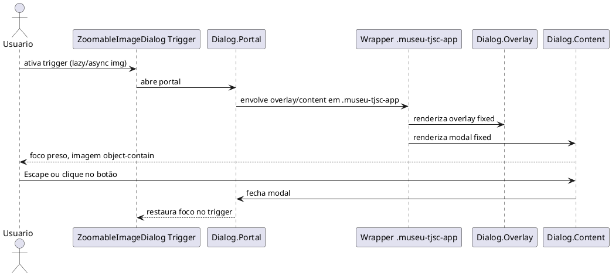

## PlantUML — Implantação

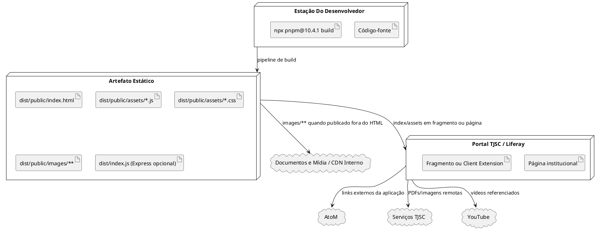

## PlantUML — Atividade De Publicação Liferay

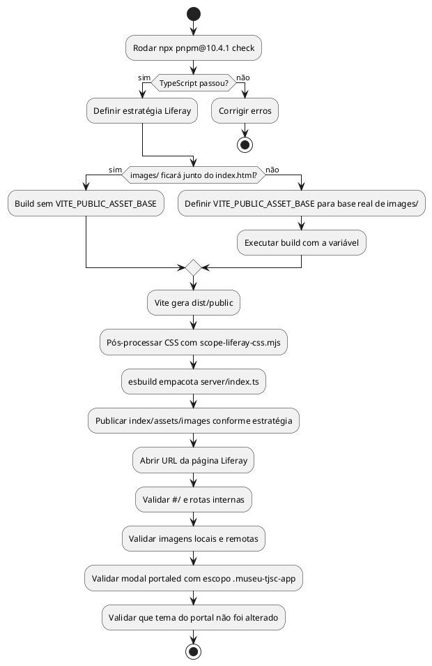

## PlantUML — Estados Do Diálogo De Imagem

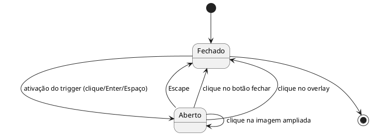

## PlantUML — Estados Da Grade De Composição

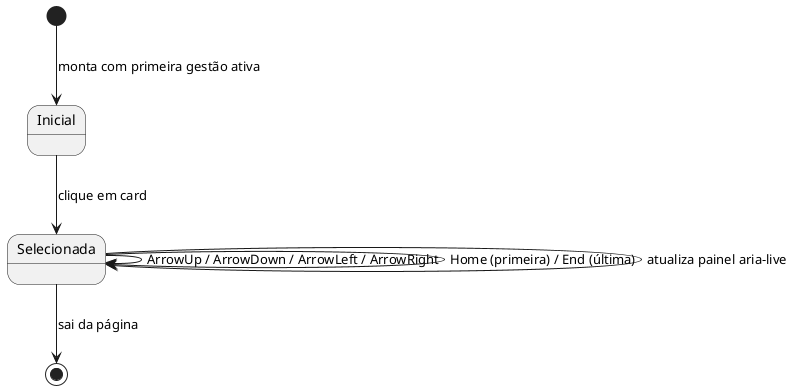

## Checklist Para Desenhar Diagramas

- Use `Visitante Público`, `Pesquisador(a)`, `Equipe Museu/Memória`, `Equipe Portal/Liferay` e `Mantenedor(a)` como atores.
- Use `App`, `Router`, `Layout`, `Pages`, `Data`, `ZoomableImageDialog`, `publicAssetUrl` e `ErrorBoundary` como componentes principais.
- Use os tipos de `client/src/data/types.ts` como classes de domínio.
- Use `dist/public` como artefato de implantação.
- Use `Portal Liferay`, `AtoM`, `Documentos/Imagens TJSC` e `YouTube` como sistemas externos.
- Modele rotas como hash routing, não como rotas absolutas de servidor.
- Modele `VITE_PUBLIC_ASSET_BASE` como configuração de publicação, não como entidade de domínio.

## Comandos De Verificação

```bash
npx pnpm@10.4.1 check
npx pnpm@10.4.1 build
```

Resultado esperado no build atual:

- `dist/public/index.html` pequeno, com referências relativas `./assets/...`.
- CSS final escopado em `.museu-tjsc-app`.
- Bundle JS único próximo de `368 KiB` (~104 KiB gzip).
- CSS final próximo de `36 KiB` (~7 KiB gzip).
- `dist/index.js` minimalista para o Express opcional.
