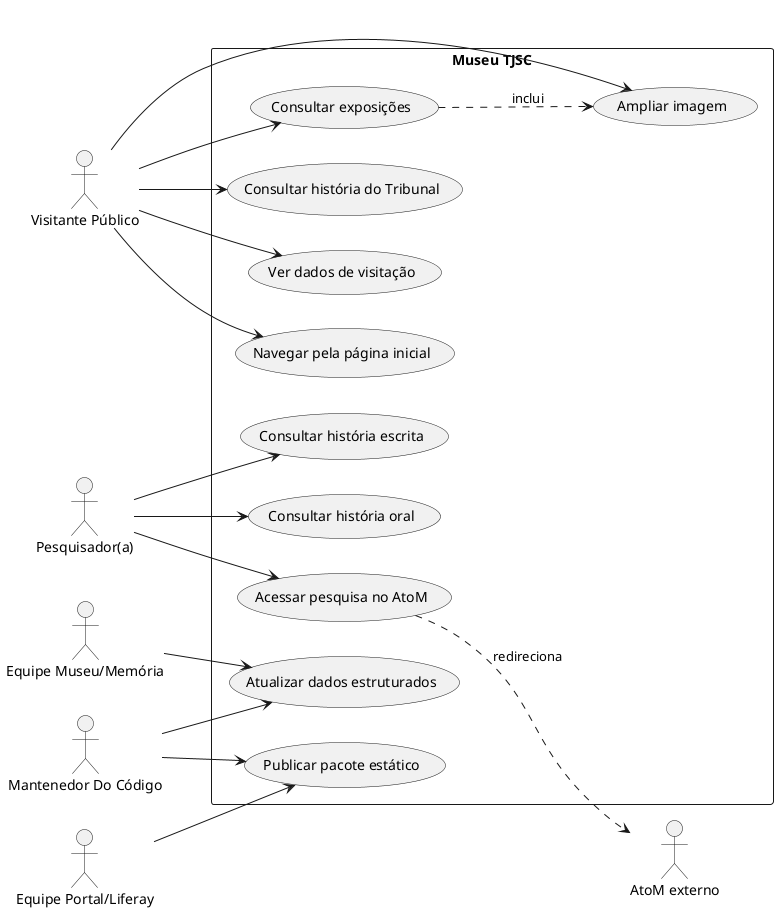
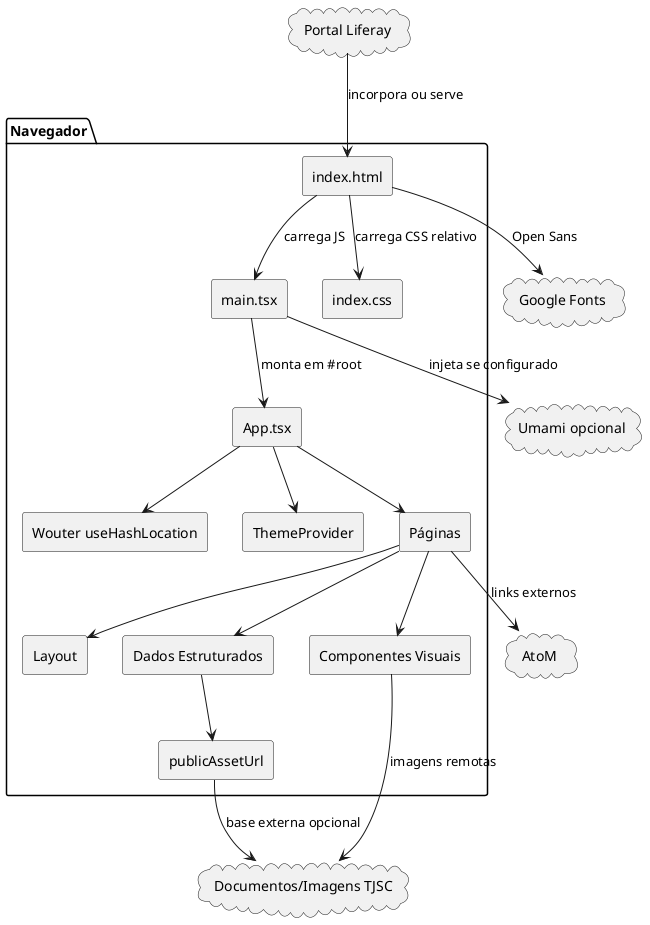
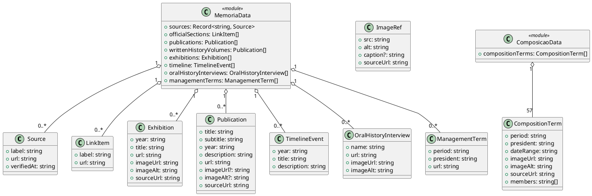
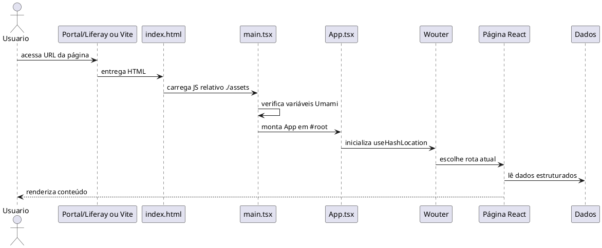
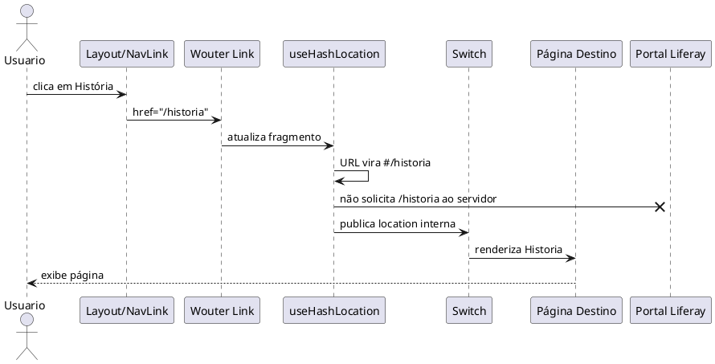
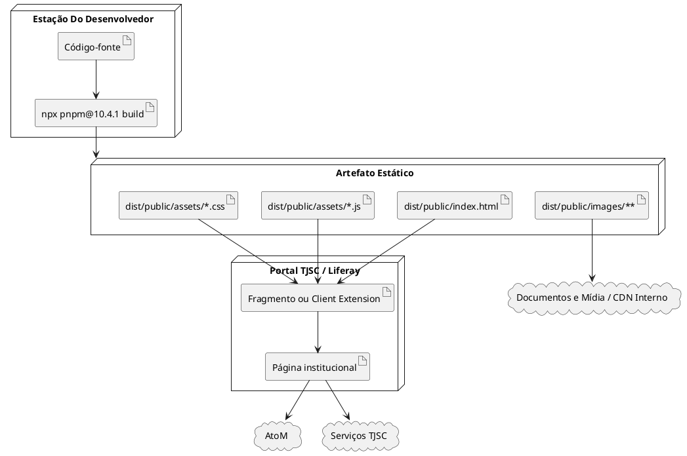
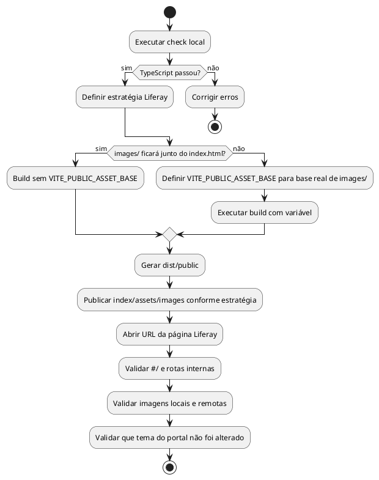
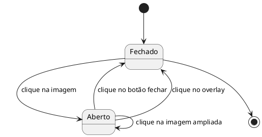

# Arquitetura E UML — Museu TJSC

Documento técnico em português do Brasil para apoiar a criação de diagramas UML do projeto `museu-tjsc`.

Atualizado em: 2026-05-20.

## Objetivo Do Sistema

O sistema é uma aplicação pública React/Vite para apresentar a área de Memória do Poder Judiciário de Santa Catarina em linguagem museológica/editorial. A aplicação centraliza dados curatoriais no código, monta páginas públicas e pode ser publicada como pacote estático em ambiente Liferay do TJSC.

O sistema não é um gestor de acervo, não é API de metadados, não é banco de dados documental e não substitui o AtoM. O AtoM permanece como plataforma externa de pesquisa arquivística avançada.

## Como Usar Este Documento Para UML

Este documento separa os elementos necessários para modelagem UML:

- Casos de uso: seção `Atores` e seção `Casos De Uso`.
- Diagrama de componentes: seção `Camadas E Componentes`.
- Diagrama de classes: seção `Modelo De Dados`.
- Diagrama de sequência: seção `Fluxos Principais`.
- Diagrama de implantação: seção `Implantação E Publicação`.
- Diagrama de atividade: seção `Fluxo De Publicação Liferay`.

Os blocos PlantUML são modelos iniciais. Eles podem ser copiados para uma ferramenta PlantUML e refinados conforme o nível de detalhe desejado.

## Fronteiras Do Sistema

### Dentro Do Sistema

- Aplicação React montada em `client/src/main.tsx`.
- Roteamento interno em `client/src/App.tsx` com Wouter e hash routing.
- Componentes de estrutura e apresentação em `client/src/components/`.
- Páginas públicas em `client/src/pages/`.
- Dados estruturados em `client/src/data/`.
- Resolução de assets locais em `client/src/lib/publicAssetUrl.ts`.
- Estilos globais escopados no mount da aplicação em `client/src/index.css`.
- Servidor Express opcional em `server/index.ts` para servir a compilação fora do Liferay.

### Fora Do Sistema

- Portal TJSC/Liferay, responsável pela página institucional hospedeira quando a aplicação for incorporada.
- AtoM, usado para pesquisa arquivística externa.
- PDFs e documentos oficiais servidos pelo TJSC.
- Imagens remotas oficiais servidas pelo TJSC.
- Google Fonts, usado para carregar `Open Sans`.
- Umami, opcional, carregado somente quando variáveis de ambiente estiverem configuradas.

## Atores

### Visitante Público

Pessoa que navega por exposições, história institucional, visitação, vídeos, publicações e páginas curatoriais.

### Pesquisador Ou Pesquisadora

Pessoa que procura acervo, história escrita, entrevistas, AtoM, biblioteca, arquivo e informações de pesquisa.

### Equipe Do Museu/Memória

Responsável por revisar conteúdo, validar dados, solicitar ajustes editoriais e aprovar publicação institucional.

### Equipe Do Portal/Liferay

Responsável por definir como os arquivos estáticos serão publicados no ecossistema TJSC: Client Extension, fragmento, Documentos e Mídia, CDN interno ou outro mecanismo institucional.

### Mantenedor Do Código

Pessoa que altera React, dados estruturados, estilos, documentação e processo de build.

### Serviços Externos

AtoM, documentos oficiais, imagens remotas, Google Fonts e Umami opcional.

## Casos De Uso

### Navegar Pelo Museu

Ator principal: Visitante Público.

Resultado esperado: usuário acessa a página inicial e segue para percursos, exposições, acervo, vídeos ou visitação.

### Consultar Exposições

Ator principal: Visitante Público.

Resultado esperado: usuário vê lista de exposições, miniaturas/cartazes e pode ampliar imagem em diálogo.

### Consultar História Do Tribunal

Ator principal: Visitante Público.

Resultado esperado: usuário navega por panorama e timeline institucional.

### Consultar História Escrita

Ator principal: Pesquisador Ou Pesquisadora.

Resultado esperado: usuário acessa publicações e volumes oficiais em PDF.

### Consultar História Oral

Ator principal: Pesquisador Ou Pesquisadora.

Resultado esperado: usuário acessa entrevistas com miniaturas oficiais remotas.

### Pesquisar Acervo No AtoM

Ator principal: Pesquisador Ou Pesquisadora.

Resultado esperado: usuário sai para `https://atom.tjsc.jus.br/` quando precisa de pesquisa arquivística avançada.

### Atualizar Conteúdo Estruturado

Ator principal: Mantenedor Do Código.

Resultado esperado: dados em `memoria.ts` ou `composicao.ts` são ajustados, verificados e compilados.

### Publicar Em Liferay

Ator principal: Equipe Do Portal/Liferay.

Resultado esperado: pacote estático é publicado sem depender da raiz do domínio, sem disputar rotas do portal e com base correta para assets locais.

## Camadas E Componentes

### Entrada Da Aplicação

- `client/index.html`: HTML base usado pelo Vite.
- `client/src/main.tsx`: injeta Umami opcional e monta `<App />` em `#root`.
- `client/src/App.tsx`: define `ErrorBoundary`, `ThemeProvider`, `TooltipProvider`, `Router` e rotas.

### Roteamento

- Biblioteca: Wouter.
- Hook atual: `useHashLocation`.
- Efeito: caminhos internos permanecem como `/historia`, `/exposicoes` e equivalentes, mas a URL do navegador usa `#/historia`, `#/exposicoes`.
- Motivo: evitar que rotas internas disputem URLs amigáveis do Liferay.

### Layout E Navegação

- `Layout.tsx`: estrutura visual comum, header, navegação primária, menu expandido e link externo AtoM.
- `PageIntro.tsx`: cabeçalho padrão de páginas internas.
- `ErrorBoundary.tsx`: proteção contra erro de renderização React.

### Componentes Visuais Especializados

- `ExhibitionCard.tsx`: apresenta exposição com imagem, ano e título.
- `ZoomableImageDialog.tsx`: abre imagem ampliada em diálogo acessível.
- `Map.tsx`: componente utilitário para Google Maps, disponível no projeto, mas não é o centro da navegação atual.

### Páginas Públicas

- `Home.tsx`: página inicial editorial.
- `Museu.tsx`: apresentação do museu e dados de visitação.
- `AcervoDigital.tsx`: núcleos de acervo e acesso ao AtoM.
- `Historia.tsx`: panorama e timeline do Tribunal.
- `HistoriaOral.tsx`: entrevistas.
- `HistoriaEscrita.tsx`: publicações e volumes oficiais.
- `Publicacoes.tsx`: reexporta `HistoriaEscrita`.
- `Exposicoes.tsx`: galeria de exposições.
- `Composicao.tsx`: gestões e composição integral por gestão.
- `Visitacoes.tsx`: horário, endereço e contatos.
- `Pesquisa.tsx`: orientação de pesquisa.
- `Arquivo.tsx`: arquivo e guarda permanente.
- `Biblioteca.tsx`: biblioteca.
- `Capela.tsx`: capela.
- `Videos.tsx`: vídeos.
- `Eventos.tsx`: eventos.
- `Atribuicoes.tsx`: atribuições.
- `NotFound.tsx`: erro de rota.

### Dados Estruturados

- `types.ts`: tipos TypeScript usados como entidades do modelo.
- `memoria.ts`: fontes, informações de visitação, publicações, exposições, timeline, vídeos, entrevistas, gestões resumidas, atribuições e percursos.
- `composicao.ts`: 57 gestões, fotos locais e membros por gestão.

### Infraestrutura De Build E Publicação

- `vite.config.ts`: Vite, React, Tailwind, aliases e `base: "./"`.
- `package.json`: scripts de desenvolvimento, checagem, compilação, pré-visualização e servidor.
- `server/index.ts`: servidor Express opcional para servir `dist/public` e fazer fallback para `index.html`.
- `client/src/lib/publicAssetUrl.ts`: base configurável para imagens/arquivos locais.

## Rotas Internas

| URL Interna | URL No Navegador Com Hash | Componente |
|---|---|---|
| `/` | `#/` | `Home` |
| `/museu` | `#/museu` | `Museu` |
| `/acervo-digital` | `#/acervo-digital` | `AcervoDigital` |
| `/historia` | `#/historia` | `Historia` |
| `/historia-oral` | `#/historia-oral` | `HistoriaOral` |
| `/historia-escrita` | `#/historia-escrita` | `HistoriaEscrita` |
| `/capela` | `#/capela` | `Capela` |
| `/videos` | `#/videos` | `Videos` |
| `/publicacoes` | `#/publicacoes` | `Publicacoes` |
| `/arquivo` | `#/arquivo` | `Arquivo` |
| `/biblioteca` | `#/biblioteca` | `Biblioteca` |
| `/composicao` | `#/composicao` | `Composicao` |
| `/exposicoes` | `#/exposicoes` | `Exposicoes` |
| `/visitacoes` | `#/visitacoes` | `Visitacoes` |
| `/pesquisa` | `#/pesquisa` | `Pesquisa` |
| `/atribuicoes` | `#/atribuicoes` | `Atribuicoes` |
| `/eventos` | `#/eventos` | `Eventos` |
| `/404` | `#/404` | `NotFound` |

## Modelo De Dados

### `Source`

Representa uma origem oficial ou interna de governança.

Campos: `label`, `url`, `verifiedAt`.

### `ImageRef`

Representa imagem com texto alternativo, legenda opcional e origem.

Campos: `src`, `alt`, `caption`, `sourceUrl`.

### `LinkItem`

Representa link simples usado em listas de navegação ou seções.

Campos: `label`, `url`.

### `Exhibition`

Representa exposição.

Campos: `year`, `title`, `url`, `imageUrl`, `imageAlt`, `sourceUrl`.

### `Publication`

Representa publicação ou volume oficial.

Campos: `title`, `subtitle`, `year`, `description`, `url`, `imageUrl`, `imageAlt`, `sourceUrl`.

### `TimelineEvent`

Representa evento histórico.

Campos: `year`, `title`, `description`.

### `OralHistoryInterview`

Representa entrevista de história oral.

Campos: `name`, `url`, `imageUrl`, `imageAlt`.

### `ManagementTerm`

Representa gestão resumida.

Campos: `period`, `president`, `url`.

### `CompositionTerm`

Representa gestão com composição integral.

Campos: `period`, `president`, `dateRange`, `imageUrl`, `imageAlt`, `sourceUrl`, `members`.

## Exportações De Dados

### `memoria.ts`

- `VERIFIED_AT`: data de verificação da coleta.
- `sources`: mapa de fontes por seção.
- `officialSections`: links institucionais principais.
- `museumFacts`: fatos resumidos do museu.
- `visitInfo`: endereço, horário, contatos e informações de visitação.
- `acervoCategories`: núcleos do acervo.
- `publications`: publicações principais.
- `writtenHistoryVolumes`: volumes oficiais da história escrita.
- `exhibitions`: 32 exposições.
- `timeline`: eventos da história institucional.
- `videos`: vídeos principais.
- `eventVideos`: vídeos de eventos.
- `oralHistoryInterviews`: 16 entrevistas.
- `managementTerms`: gestões resumidas.
- `atribuicoes`: atribuições institucionais.
- `curatedPaths`: percursos editoriais da página inicial.

### `composicao.ts`

- `compositionTerms`: 57 gestões com presidente, período, foto, fonte e lista de membros.

## Regras De Assets

### URLs Remotas

URLs `http`, `https`, `mailto`, `tel`, `#` e `data:` são preservadas por `publicAssetUrl`.

### Assets Locais Sem Base Externa

Um caminho local como `/images/composicao/gestao-2024-2026.jpg` vira `./images/composicao/gestao-2024-2026.jpg`.

### Assets Locais Com Base Externa

Se `VITE_PUBLIC_ASSET_BASE` estiver definida, o mesmo caminho vira `{VITE_PUBLIC_ASSET_BASE}/images/composicao/gestao-2024-2026.jpg`.

Essa variável deve apontar para a base que contém `images/`, não para a URL da página Liferay.

## Fluxos Principais

### Fluxo De Inicialização

1. Navegador carrega `index.html`.
2. Vite entrega CSS e JS por caminhos relativos `./assets/...`.
3. `main.tsx` verifica variáveis de métricas.
4. Se métricas existirem, injeta script Umami.
5. `main.tsx` monta `<App />` em `#root`.
6. `App.tsx` cria provedores e roteador por hash.
7. Rota atual renderiza a página correspondente.

### Fluxo De Navegação Interna

1. Usuário clica em um `<Link href="/historia">`.
2. Wouter intercepta o clique.
3. `useHashLocation` atualiza a URL para `#/historia`.
4. O navegador não pede `/historia` ao Liferay.
5. `Switch` renderiza `Historia`.

### Fluxo De Imagem Ampliável

1. Página passa `imageUrl`, `imageAlt` e dados de legenda para `ExhibitionCard`.
2. `ExhibitionCard` renderiza `ZoomableImageDialog`.
3. Usuário aciona o botão da imagem.
4. `ZoomableImageDialog` altera estado local `open` para `true`.
5. Diálogo modal é renderizado com imagem em `object-contain`.
6. Clique externo ou botão fechar retorna `open` para `false`.

### Fluxo De Publicação Liferay

1. Mantenedor executa `npx pnpm@10.4.1 build`.
2. Vite gera `dist/public/index.html`, `dist/public/assets/` e `dist/public/images/`.
3. `index.html` referencia JS/CSS com `./assets/...`.
4. Equipe do portal publica os arquivos no mecanismo aprovado.
5. Se `images/` não ficar no mesmo contexto de diretório do HTML, build deve receber `VITE_PUBLIC_ASSET_BASE`.
6. Página Liferay carrega o fragmento, Client Extension ou HTML estático.
7. A aplicação navega por hash e evita conflito com rotas do portal.

## Implantação E Publicação

### Desenvolvimento Local

Comando: `npx pnpm@10.4.1 dev`.

URL padrão: `http://localhost:3000/#/`.

### Pré-Visualização Estática

Comandos:

```bash
npx pnpm@10.4.1 build
npx pnpm@10.4.1 preview
```

URL comum: `http://localhost:4173/#/`.

### Servidor Express Opcional

Comandos:

```bash
npx pnpm@10.4.1 build
npx pnpm@10.4.1 start
```

Esse modo serve `dist/public` e devolve `index.html` para todas as rotas. Em Liferay, o Express normalmente não é usado.

### Liferay Com Arquivos Estáticos

Artefatos importantes:

- `dist/public/index.html`.
- `dist/public/assets/*.js`.
- `dist/public/assets/*.css`.
- `dist/public/images/**`.

Se a equipe publicar `index.html`, `assets/` e `images/` no mesmo contexto de diretório, a base relativa tende a funcionar sem variável adicional.

Se a equipe usar fragment/snippet e os assets estiverem em outra base, definir `VITE_PUBLIC_ASSET_BASE` antes do build.

Exemplo:

```bash
VITE_PUBLIC_ASSET_BASE="https://www.tjsc.jus.br/documents/d/memoria-museu/museu-static" npx pnpm@10.4.1 build
```

## Variáveis De Ambiente

| Variável | Uso | Obrigatória |
|---|---|---|
| `VITE_PUBLIC_ASSET_BASE` | Base pública para `images/` e assets locais quando publicados fora do diretório do HTML | Não |
| `VITE_ANALYTICS_ENDPOINT` | Endpoint Umami | Não |
| `VITE_ANALYTICS_WEBSITE_ID` | Identificador do site no Umami | Não |
| `PORT` | Porta do servidor Express opcional | Não |
| `NODE_ENV` | Define caminho estático no servidor Express | Não |

## Regras De Segurança E Governança

- Não commitar `.project-config.json`.
- Não commitar `.env*`.
- Não commitar `node_modules/`.
- Não commitar `dist/`.
- Não commitar `.manus-logs/`.
- Não reintroduzir runtime/debug Manus.
- Não reintroduzir `SourceLink` ou CTA público genérico `Ver no TJSC`.
- Não colocar chaves, tokens ou credenciais em documentação pública.
- Não afirmar fato histórico sem fonte oficial em dados estruturados.

## Pontos De Extensão

### Nova Página

1. Criar arquivo em `client/src/pages/`.
2. Adicionar rota em `client/src/App.tsx`.
3. Adicionar item de navegação em `Layout.tsx` se for página principal.
4. Usar `Layout` e `PageIntro` para consistência visual.
5. Se usar dados oficiais, registrar origem em `memoria.ts`.

### Nova Exposição

1. Adicionar item em `exhibitions` dentro de `memoria.ts`.
2. Usar URL e imagem oficial quando disponível.
3. Para imagem local, usar `publicAssetUrl("/images/...")`.
4. Evitar duplicar título/ano em legenda pública.

### Nova Publicação

1. Adicionar item em `publications` ou `writtenHistoryVolumes`.
2. Informar `title`, `subtitle`, `year`, `description`, `url` e `sourceUrl`.
3. Usar `imageUrl` quando houver imagem editorial ou capa adequada.

### Nova Entrevista De História Oral

1. Adicionar item em `oralHistoryInterviews`.
2. Manter miniatura oficial em tamanho controlado.
3. Evitar ampliar imagem remota de baixa resolução além do tamanho nativo aproximado.

## PlantUML — Casos De Uso



## PlantUML — Componentes



## PlantUML — Classes De Dados



## PlantUML — Sequência De Inicialização



## PlantUML — Sequência De Navegação Hash



## PlantUML — Implantação



## PlantUML — Atividade De Publicação Liferay



## PlantUML — Estados Do Diálogo De Imagem



## Checklist Para Desenhar Diagramas

- Use `Visitante Público`, `Pesquisador(a)`, `Equipe Museu/Memória`, `Equipe Portal/Liferay` e `Mantenedor Do Código` como atores.
- Use `App`, `Router`, `Layout`, `Pages`, `Data`, `publicAssetUrl` e `ThemeProvider` como componentes principais.
- Use os tipos de `client/src/data/types.ts` como classes de domínio.
- Use `dist/public` como artefato de implantação.
- Use `Portal Liferay`, `AtoM`, `Documentos/Imagens TJSC`, `Google Fonts` e `Umami` como sistemas externos.
- Modele rotas como hash routing, não como rotas absolutas de servidor.
- Modele `VITE_PUBLIC_ASSET_BASE` como configuração de publicação, não como entidade de domínio.

## Comandos De Verificação

```bash
npx pnpm@10.4.1 check
npx pnpm@10.4.1 build
```

Resultado esperado no build atual:

- `dist/public/index.html` pequeno, com cerca de `0.73 kB`.
- CSS e JS referenciados por `./assets/...`.
- Navegação local acessível por `http://localhost:3000/#/` em desenvolvimento ou `http://localhost:4173/#/` em pré-visualização.
