# Guia De Apresentação E Documentação — Museu TJSC

Passo a passo para exibir a aplicação aos clientes, mostrar e gerar a documentação técnica em formatos finais (PDF, HTML, diagramas UML).

Atualizado em: 2026-05-20.

## Objetivo

Garantir que, em qualquer reunião, o apresentador consiga:

1. Demonstrar a aplicação rodando localmente.
2. Mostrar a documentação técnica de forma legível.
3. Entregar pacotes em PDF/HTML para registro do cliente.
4. Renderizar os diagramas UML quando o cliente pedir.

## Material Obrigatório Antes Da Reunião

- Repositório atualizado: `git pull origin main` (clone público, não exige login).
- Aplicação compilando: `npx pnpm@10.4.1 check && npx pnpm@10.4.1 build`.
- Pré-visualização no ar: `npx pnpm@10.4.1 preview`, acessível em `http://127.0.0.1:4173/#/`.
- Navegador com duas abas:
  - Aba 1: aplicação rodando localmente.
  - Aba 2: repositório público no GitHub para mostrar a documentação direto pelo navegador.
- Editor com o repositório aberto, caso o cliente queira detalhes técnicos.
- PDF da documentação consolidada (ver `Gerar PDF Consolidado`).

## Roteiro De Demonstração Em 15 Minutos

| Tempo | Etapa | O que mostrar |
|---|---|---|
| 0–2 min | Introdução | Objetivo do projeto, integração com o portal, escopo (não é gestor de acervo) |
| 2–4 min | Home | Hero, sala permanente, faixa de percursos |
| 4–6 min | Exposições | Galeria, modal de imagem, link para a página oficial |
| 6–8 min | Composição | Grade de 57 gestões, navegação por teclado, painel lateral |
| 8–10 min | História escrita / oral | 2 publicações + 9 volumes + 16 vídeos |
| 10–12 min | Museu, Visitação, Capela | Dados oficiais e ícone local |
| 12–13 min | Acervo + AtoM | Busca textual; pesquisa avançada no AtoM externo |
| 13–14 min | Documentação | README, mapa do site, UML |
| 14–15 min | Próximos passos | Publicação Liferay e fluxo de manutenção |

## Tour Pelas Rotas Principais

Use as URLs com hash. Se a aplicação estiver em `http://127.0.0.1:4173`, os links são:

- `http://127.0.0.1:4173/#/`
- `http://127.0.0.1:4173/#/exposicoes`
- `http://127.0.0.1:4173/#/composicao`
- `http://127.0.0.1:4173/#/historia`
- `http://127.0.0.1:4173/#/historia-escrita`
- `http://127.0.0.1:4173/#/historia-oral`
- `http://127.0.0.1:4173/#/acervo-digital`
- `http://127.0.0.1:4173/#/capela`
- `http://127.0.0.1:4173/#/biblioteca`
- `http://127.0.0.1:4173/#/visitacoes`

Lista completa em [`mapa-do-site.md`](mapa-do-site.md).

## Apresentar A Documentação No GitHub

O repositório é **público**, então qualquer pessoa com o link consegue ver. É a forma mais simples de mostrar para o cliente sem instalar nada:

1. Abra `https://github.com/guilhermespamplona-prog/museu-tjsc`.
2. O GitHub renderiza `README.md` na página inicial automaticamente.
3. Navegue para `docs/` e abra cada arquivo `.md`. O GitHub formata tabelas, código e listas.
4. Use as âncoras das seções para enviar links diretos. Exemplo: `https://github.com/guilhermespamplona-prog/museu-tjsc/blob/main/docs/arquitetura-uml.md#fluxos-principais`.

> Diagramas PlantUML não são renderizados pelo GitHub. Para mostrá-los como imagens, use uma das opções da próxima seção.

## Apresentação Visual Para Leigos (PDF Pronto)

Já existe um pacote pronto para clientes que não querem ver código:

- `docs/apresentacao-leigos.html` — wireframes simples explicando cada tela.
- `docs/apresentacao-leigos.pdf` — versão pronta para imprimir/anexar.

Para regenerar o PDF a partir do HTML:

```bash
npx pnpm@10.4.1 run docs:pdf
```

Esse comando usa o Chromium headless (do Playwright) ou qualquer Chromium/Chrome instalado. Se nada estiver disponível, abra o HTML no navegador (`Ctrl + P` → Salvar como PDF).

## Diagramas UML Renderizados

Os diagramas PlantUML estão em `docs/arquitetura-uml.md`, mas também ficam prontos como arquivos individuais e imagens:

- Fontes: `docs/diagramas/*.puml` (13 diagramas).
- Imagens: `docs/diagramas/svg/*.svg` (geradas pelo PlantUML).
- Pacote visual: `docs/diagramas/index.html` (todos os diagramas comentados em uma página).
- PDF consolidado: `docs/diagramas/diagramas-uml.pdf`.

Para regenerar tudo (extrair fontes, renderizar SVGs e gerar PDFs):

```bash
npx pnpm@10.4.1 run docs:all
```

O `docs:diagramas` usa o servidor público `plantuml.com` por padrão. Se preferir gerar offline, baixe `plantuml.jar` (https://github.com/plantuml/plantuml/releases) e exporte:

```bash
PLANTUML_JAR=/caminho/para/plantuml.jar npx pnpm@10.4.1 run docs:diagramas
```

### Renderizar Diagramas Manualmente

Os blocos PlantUML em `docs/arquitetura-uml.md` têm o formato:

```plantuml
@startuml
...
@enduml
```



### Opção 1 — VS Code (recomendado)

1. Instale **Visual Studio Code** (`https://code.visualstudio.com/`).
2. Instale a extensão **PlantUML** (Marketplace, autor `jebbs.plantuml`).
3. Instale o **Java JRE** (`https://adoptium.net/temurin/releases/`).
4. Instale o **Graphviz** (`https://graphviz.org/download/`).
5. Abra `docs/arquitetura-uml.md` no VS Code.
6. Posicione o cursor dentro de um bloco `@startuml ... @enduml` e pressione `Alt + D`. O preview aparece ao lado.
7. Para exportar como imagem, clique com o botão direito → `Export current diagram` e escolha `png` ou `svg`.

### Opção 2 — Servidor Online (rápido)

1. Acesse `https://www.plantuml.com/plantuml/uml`.
2. Cole o conteúdo de um bloco `@startuml ... @enduml`.
3. O site gera o PNG/SVG.
4. Baixe e salve no seu material.

> Não use o servidor público para diagramas sigilosos. Para este projeto, os diagramas descrevem arquitetura pública, então o uso é aceitável.

### Opção 3 — CLI Local Via Docker

```bash
docker run --rm -v "$PWD:/data" plantuml/plantuml -tsvg docs/arquitetura-uml.md
```

Gera arquivos `.svg` ao lado do markdown.

### Exportar Todos Os Diagramas De Uma Vez

Com PlantUML instalado localmente (Java + jar `plantuml.jar`):

```bash
mkdir -p docs/diagramas
java -jar plantuml.jar -tsvg -o diagramas docs/arquitetura-uml.md
```

Vai gerar um SVG por bloco `@startuml` dentro de `docs/diagramas/`.

## Gerar PDF Consolidado

Pacote único contendo `README.md`, guias e documentação técnica.

### Opção 1 — Pandoc (recomendado)

1. Instale **Pandoc** (`https://pandoc.org/installing.html`) e **wkhtmltopdf** (`https://wkhtmltopdf.org/downloads.html`) ou o **TeX Live**/**MiKTeX**.
2. No PowerShell (na raiz do projeto):
   ```powershell
   pandoc README.md docs/arquitetura-uml.md docs/mapa-do-site.md docs/guia-execucao-local.md docs/guia-apresentacao.md ideas.md `
     -o museu-tjsc-documentacao.pdf `
     --metadata title="Memória TJSC — Documentação Técnica" `
     --metadata author="Equipe Memória TJSC" `
     --metadata date="2026-05-20" `
     --toc --toc-depth=2 -V geometry:margin=2cm
   ```
3. Resultado: `museu-tjsc-documentacao.pdf`.

### Opção 2 — VS Code Markdown PDF

1. Instale a extensão **Markdown PDF** (autor `yzane.markdown-pdf`).
2. Abra um arquivo `.md` no VS Code.
3. `Ctrl + Shift + P` → `Markdown PDF: Export (pdf)`.
4. O PDF é gerado ao lado do markdown.

> Para um único PDF com todos os arquivos, prefira o Pandoc.

### Opção 3 — HTML Estático

```powershell
pandoc README.md docs/arquitetura-uml.md docs/mapa-do-site.md docs/guia-execucao-local.md docs/guia-apresentacao.md ideas.md `
  -o museu-tjsc-documentacao.html `
  --standalone `
  --toc --toc-depth=2 `
  --metadata title="Memória TJSC — Documentação Técnica"
```

Resultado: `museu-tjsc-documentacao.html`, abrível em qualquer navegador.

## Apresentar A Aplicação No Telão

1. Antes da reunião:
   - `npx pnpm@10.4.1 build`.
   - `npx pnpm@10.4.1 preview`.
   - Confirme `http://127.0.0.1:4173/#/`.
2. No início da reunião:
   - Maximize o navegador.
   - Use o modo "Apresentação" do navegador (`F11` no Windows) para esconder a barra de URL.
3. Para mostrar acessibilidade:
   - Pressione `Tab` para exibir o link `Ir para o conteúdo principal`.
   - Em `/composicao`, use `↑ ↓ → ← Home End` para navegar pelas gestões.
4. Para encerrar:
   - `Ctrl + C` no terminal do `preview`.

## Apresentar A Documentação No Telão

- Modo simples: abra a aba do GitHub no repositório.
- Modo offline: abra o PDF consolidado.
- Modo navegação por código: abra o VS Code com a pasta do projeto, use `Ctrl + Shift + V` para preview de markdown em qualquer `.md`.

## Checklist Antes Da Reunião

- [ ] `git pull origin main` executado.
- [ ] `npx pnpm@10.4.1 install` em dia.
- [ ] `npx pnpm@10.4.1 check` sem erros.
- [ ] `npx pnpm@10.4.1 build` sem erros.
- [ ] `npx pnpm@10.4.1 preview` rodando.
- [ ] Navegador apontando para `http://127.0.0.1:4173/#/`.
- [ ] PDF consolidado gerado (se o cliente pediu material para anexar).
- [ ] Diagramas UML exportados em SVG/PNG se houver discussão de arquitetura.
- [ ] Internet liberada para abrir AtoM e páginas oficiais.

## Pacote Para Entregar Ao Cliente

Estrutura sugerida para um zip ou pasta compartilhada:

```text
museu-tjsc-apresentacao/
├── 01_aplicacao/
│   ├── README.txt                instrução curta para executar (link para docs/guia-execucao-local.md)
│   └── dist-publico/             cópia de dist/public após build (opcional)
├── 02_documentacao/
│   ├── museu-tjsc-documentacao.pdf
│   ├── museu-tjsc-documentacao.html
│   └── markdown/
│       ├── README.md
│       ├── ideas.md
│       └── docs/
│           ├── arquitetura-uml.md
│           ├── mapa-do-site.md
│           ├── guia-execucao-local.md
│           └── guia-apresentacao.md
├── 03_diagramas/
│   ├── casos-de-uso.svg
│   ├── componentes.svg
│   ├── classes-de-dados.svg
│   ├── sequencia-inicializacao.svg
│   ├── sequencia-navegacao-hash.svg
│   ├── sequencia-skip-link.svg
│   ├── sequencia-composicao.svg
│   ├── sequencia-imagem-ampliavel.svg
│   ├── implantacao.svg
│   ├── atividade-publicacao-liferay.svg
│   ├── estados-dialogo-imagem.svg
│   └── estados-grade-composicao.svg
└── 04_capturas/
    ├── home.png
    ├── exposicoes.png
    ├── composicao.png
    └── capela.png
```

## Roteiro De Fala Pronto

> "O Memória TJSC é uma aplicação React/Vite que reorganiza o conteúdo da área de Memória do Tribunal em uma experiência museológica, sem competir com o portal institucional. A navegação é por hash, então qualquer publicação dentro do Liferay continua estável. Os dados são estruturados em código, sob fonte oficial, e a interface é construída em camadas: cabeçalho integrado, percursos editoriais e páginas curatoriais. Hoje temos 32 exposições, 9 volumes de história escrita, 16 vídeos de história oral, 57 gestões com composição integral e páginas dedicadas para Museu, Capela, Biblioteca, Arquivo, Visitação e Pesquisa. A documentação no repositório inclui arquitetura completa em UML, mapa do site e guias operacionais. O próximo passo é validar a publicação no Liferay com a equipe do portal."

## Atualizar Este Guia

Sempre que houver mudança grande na pilha ou na forma de demonstrar, atualize a tabela de roteiro, os comandos e a lista de URLs. Mantenha as orientações de Windows em primeiro plano, porque é o ambiente padrão da maioria dos clientes do TJSC.
